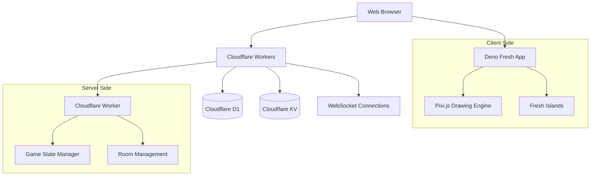

# Design Document

## Overview

The multiplayer drawing game is a real-time web application built with Deno Fresh and deployed to Cloudflare Workers. Players can create or join game rooms, take turns drawing while others guess, and compete for points based on guess timing. The application leverages Pixi.js for high-performance drawing capabilities and Cloudflare's infrastructure for scalable real-time communication.

## Architecture

### High-Level Architecture



### Technology Stack

- **Frontend Framework**: Deno Fresh with TypeScript
- **Drawing Engine**: Pixi.js v8 for high-performance 2D graphics
- **Real-time Communication**: WebSockets via Cloudflare Workers
- **Database**: Cloudflare D1 (SQLite) for persistent data
- **Cache/Session Storage**: Cloudflare KV for temporary game state
- **Deployment**: Cloudflare Workers with edge computing

## Components and Interfaces

### Frontend Components

#### 1. Game Lobby (Fresh Route)
- **Path**: `/` (main route)
- **Purpose**: Display available rooms and allow room creation/joining
- **Data Sources**: 
  - Cloudflare D1 for room persistence
  - WebSocket for real-time room updates
- **Key Features**:
  - Room list with player counts
  - Create room modal
  - Join room functionality
  - Player name input

#### 2. Game Room (Fresh Island)
- **Path**: `/room/[id]` (dynamic route)
- **Purpose**: Main gameplay interface
- **Components**:
  - Drawing Board Island (Pixi.js integration)
  - Chat Room Island
  - Scoreboard Island
  - Game Controls Island

#### 3. Drawing Board Island
- **Technology**: Pixi.js Application within Fresh Island
- **Features**:
  - Real-time drawing synchronization
  - Drawing tools (brush, colors, sizes)
  - Canvas clearing
  - Touch and mouse support
- **WebSocket Events**:
  - `draw-start`, `draw-move`, `draw-end`
  - `canvas-clear`
  - `tool-change`

#### 4. Chat Room Island
- **Purpose**: Player communication and guessing
- **Features**:
  - Message history
  - Guess validation
  - Real-time message delivery
- **WebSocket Events**:
  - `chat-message`
  - `correct-guess`
  - `player-joined/left`

#### 5. Scoreboard Island
- **Purpose**: Display current scores and game status
- **Features**:
  - Real-time score updates
  - Turn indicator
  - Timer display
  - Player list with roles

### Backend Components

#### 1. WebSocket Handler
- **Purpose**: Manage real-time connections and message routing
- **Key Functions**:
  - Connection management
  - Room-based message broadcasting
  - Event validation and sanitization
  - Connection cleanup

#### 2. Game State Manager
- **Purpose**: Maintain game logic and state transitions
- **Key Functions**:
  - Turn rotation management
  - Score calculation
  - Game phase transitions
  - Rule enforcement

#### 3. Room Manager
- **Purpose**: Handle room lifecycle and player management
- **Key Functions**:
  - Room creation/deletion
  - Player join/leave operations
  - Room capacity management
  - Host privileges

#### 4. Drawing Synchronization Service
- **Purpose**: Optimize and broadcast drawing data
- **Key Functions**:
  - Drawing data compression
  - Batch drawing operations
  - Canvas state management
  - Conflict resolution

## Data Models

### Database Schema (Cloudflare D1)

```sql
-- Rooms table for persistent room data
CREATE TABLE rooms (
    id TEXT PRIMARY KEY,
    name TEXT NOT NULL,
    host_id TEXT NOT NULL,
    max_players INTEGER DEFAULT 8,
    is_active BOOLEAN DEFAULT true,
    created_at DATETIME DEFAULT CURRENT_TIMESTAMP,
    updated_at DATETIME DEFAULT CURRENT_TIMESTAMP
);

-- Players table for user sessions
CREATE TABLE players (
    id TEXT PRIMARY KEY,
    name TEXT NOT NULL,
    room_id TEXT,
    is_host BOOLEAN DEFAULT false,
    joined_at DATETIME DEFAULT CURRENT_TIMESTAMP,
    FOREIGN KEY (room_id) REFERENCES rooms(id)
);

-- Game sessions for completed games
CREATE TABLE game_sessions (
    id TEXT PRIMARY KEY,
    room_id TEXT NOT NULL,
    winner_id TEXT,
    total_rounds INTEGER,
    started_at DATETIME,
    ended_at DATETIME,
    FOREIGN KEY (room_id) REFERENCES rooms(id),
    FOREIGN KEY (winner_id) REFERENCES players(id)
);

-- Scores for tracking player performance
CREATE TABLE scores (
    id TEXT PRIMARY KEY,
    session_id TEXT NOT NULL,
    player_id TEXT NOT NULL,
    points INTEGER DEFAULT 0,
    correct_guesses INTEGER DEFAULT 0,
    FOREIGN KEY (session_id) REFERENCES game_sessions(id),
    FOREIGN KEY (player_id) REFERENCES players(id)
);
```

### KV Storage Schema

```typescript
// Game state stored in Cloudflare KV
interface GameState {
  roomId: string;
  currentDrawer: string;
  currentWord: string;
  roundNumber: number;
  timeRemaining: number;
  phase: 'waiting' | 'drawing' | 'guessing' | 'results';
  players: Player[];
  scores: Record<string, number>;
  drawingData: DrawingCommand[];
}

interface Player {
  id: string;
  name: string;
  isHost: boolean;
  isConnected: boolean;
  lastActivity: number;
}

interface DrawingCommand {
  type: 'start' | 'move' | 'end' | 'clear';
  x?: number;
  y?: number;
  color?: string;
  size?: number;
  timestamp: number;
}

interface ChatMessage {
  id: string;
  playerId: string;
  playerName: string;
  message: string;
  timestamp: number;
  isGuess: boolean;
  isCorrect?: boolean;
}
```

## Error Handling

### Client-Side Error Handling

1. **WebSocket Connection Errors**
   - Automatic reconnection with exponential backoff
   - Connection status indicator
   - Offline mode with local state preservation

2. **Drawing Synchronization Errors**
   - Local drawing buffer for failed transmissions
   - Canvas state recovery mechanisms
   - Conflict resolution for simultaneous drawing

3. **User Input Validation**
   - Real-time form validation
   - Sanitization of chat messages
   - Drawing command validation

### Server-Side Error Handling

1. **WebSocket Management**
   - Connection timeout handling
   - Graceful disconnection cleanup
   - Room state consistency checks

2. **Database Operations**
   - Transaction rollback on failures
   - Retry mechanisms for temporary failures
   - Data integrity validation

3. **Game Logic Errors**
   - Invalid state transition handling
   - Player action validation
   - Score calculation verification

## Testing Strategy

### Unit Testing

1. **Game Logic Testing**
   - Turn rotation algorithms
   - Score calculation functions
   - State transition validation
   - Drawing command processing

2. **Data Model Testing**
   - Database schema validation
   - KV storage operations
   - Data serialization/deserialization

### Integration Testing

1. **WebSocket Communication**
   - Message routing accuracy
   - Connection handling
   - Room broadcasting

2. **Database Integration**
   - CRUD operations
   - Transaction handling
   - Data consistency

### End-to-End Testing

1. **Gameplay Scenarios**
   - Complete game flow testing
   - Multi-player interactions
   - Real-time synchronization

2. **Performance Testing**
   - Concurrent user handling
   - Drawing data throughput
   - Memory usage optimization

### Browser Compatibility Testing

1. **Cross-Browser Support**
   - WebSocket compatibility
   - Pixi.js rendering consistency
   - Touch device support

2. **Mobile Responsiveness**
   - Touch drawing accuracy
   - UI scaling
   - Performance on mobile devices

## Performance Considerations

### Client-Side Optimization

1. **Pixi.js Optimization**
   - Efficient sprite batching
   - Texture atlas usage
   - Render loop optimization
   - Memory management

2. **Drawing Performance**
   - Path simplification algorithms
   - Throttled drawing events
   - Canvas rendering optimization

3. **Network Optimization**
   - Message batching
   - Data compression
   - Selective updates

### Server-Side Optimization

1. **WebSocket Scaling**
   - Connection pooling
   - Message queuing
   - Load balancing across edge locations

2. **Database Performance**
   - Query optimization
   - Index strategy
   - Connection pooling

3. **Memory Management**
   - Game state cleanup
   - Connection garbage collection
   - KV storage expiration

## Security Considerations

### Input Validation
- Sanitize all user inputs (chat messages, player names)
- Validate drawing commands for reasonable bounds
- Rate limiting for message sending and drawing actions

### Authentication & Authorization
- Session-based player identification
- Host privilege validation
- Room access control

### Data Protection
- No persistent storage of sensitive data
- Temporary session data in KV with TTL
- Secure WebSocket connections (WSS)

### Anti-Cheat Measures
- Server-side game state validation
- Drawing command verification
- Score calculation on server
- Time-based guess validation

## Deployment Architecture

### Cloudflare Workers Configuration
- Edge deployment for low latency
- WebSocket support enabled
- D1 database binding
- KV namespace binding
- Custom domain configuration

### Environment Management
- Development, staging, and production environments
- Environment-specific configuration
- Database migration strategy
- Monitoring and logging setup

## Real-Time Communication Protocol

### WebSocket Message Types

```typescript
// Client to Server Messages
interface ClientMessage {
  type: 'join-room' | 'leave-room' | 'chat' | 'draw' | 'guess' | 'start-game';
  roomId: string;
  playerId: string;
  data: any;
}

// Server to Client Messages
interface ServerMessage {
  type: 'room-update' | 'chat-message' | 'draw-update' | 'game-state' | 'score-update';
  roomId: string;
  data: any;
}
```

### Message Flow Examples

1. **Drawing Synchronization**
   ```
   Client A: draw-start → Server → Broadcast to Room → Clients B,C,D
   Client A: draw-move → Server → Broadcast to Room → Clients B,C,D
   Client A: draw-end → Server → Broadcast to Room → Clients B,C,D
   ```

2. **Chat and Guessing**
   ```
   Client B: chat-message → Server → Validate Guess → Broadcast Result
   Server: score-update → All Clients in Room
   ```

This design provides a scalable, performant foundation for the multiplayer drawing game while leveraging Cloudflare's edge infrastructure for optimal user experience.